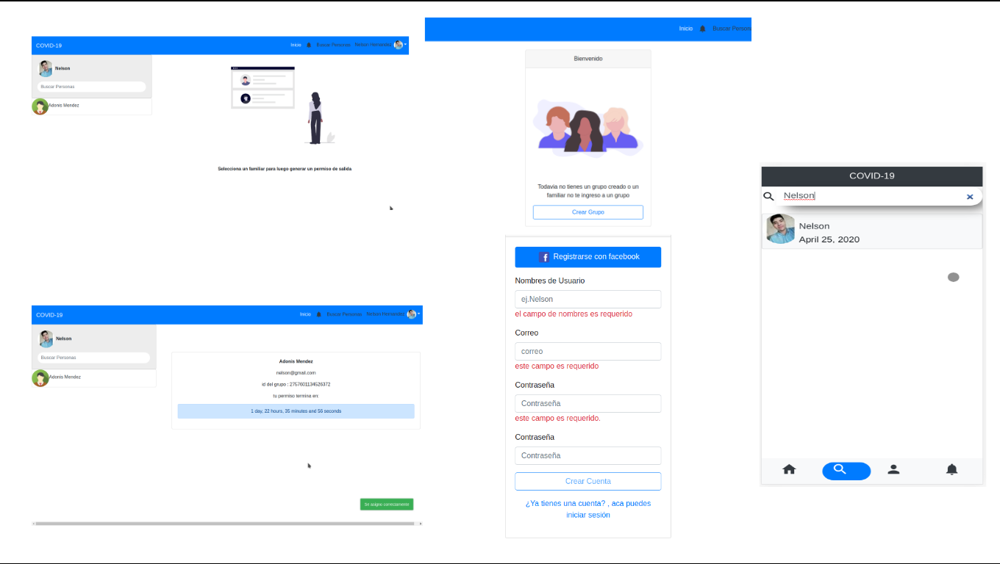

# Codevid-19

Es una aplicación web la cual esta orientada a la solución del problema **“muchas personas en la calle con un objetivo innecesario o invalido”**

## ¿ En que consiste la aplicación web?

En crear un grupo en el cual se integren grupos de personas **(familiares)** para poder decidir quien podra salir de su hogar.

### Proyecto actualmente en Beta y realizado en 17 dias

### Integraciones
* Login con facebook
* Login Local
* Base de datos MongoDB
* Lenguaje backend JavaScript (Node.js)
* Lenguaje frontend JavaScript (Vue.js)
* Diseño con Bootstrap 4

## Creadores 

**Nelson Adonis Hernandez**
* Github
[https://github.com/Nelson-developer](https://github.com/Nelson-developer)
* Codepen
[https://codepen.io/nelson-developer](https://codepen.io/nelson-developer)
* Blog
[ehttps://nelsonweb.netlify.app/](https://nelsonweb.netlify.app/)

**Samuel Benjamin Campos**
* Github
[https://github.com/SamuelCamposM](https://github.com/SamuelCamposM)

